```{r, echo = FALSE}
library(knitr);
opts_chunk$set(echo = FALSE);
```

## Introduction: What is an R package?

- Bundles of code and data that can be written by anyone in the R community \pause
- Held in online repositories
    - [Comprehensive R Archive Network (CRAN)](https://cran.r-project.org/) (`install.packages()`)
    - [GitHub](http://github.com) (`devtools::install_github()`) \pause
- CRAN currently holds over 13000 R packages \pause
- R packages are wide ranging
    - Massive multi-person development efforts for [large scale coding projects](https://cran.r-project.org/package=vegan)
    - Small [joke packages](https://github.com/psolymos/KnockKnockJokes) with minimal code
    - Personal packages customised for an individual user


## Two packages that need to be installed

**The [`devtools`](https://cran.r-project.org/package=devtools) package:**

> Devtools makes package development a breeze: it works with R’s existing conventions for code structure, adding efficient tools to support the cycle of package development. With devtools, developing a package becomes so easy that it will be your default layout whenever you’re writing a significant amount of code. 

\pause

**The [`roxygen2`](https://cran.r-project.org/package=roxygen2) package:**

> The goal of roxygen2 is to make documenting your code as easy as possible. R provides a standard way of documenting packages: you write .Rd files in the man/ directory. 


## The most basic R package

**Goal**: Create an R package that includes two functions.

```{r, echo = TRUE}
# Convert Fahrenheit to Celsius
F_to_C <- function(F_temp){
    C_temp <- (F_temp - 32) * 5/9;
    return(C_temp);
}

# Convert Celsius to Fahrenheit
C_to_F <- function(C_temp){
    F_temp <- (C_temp * 9/5) + 32;
    return(F_temp);
}
```

## The most basic R package

**First, create a new folder in your computer**

<br><center>
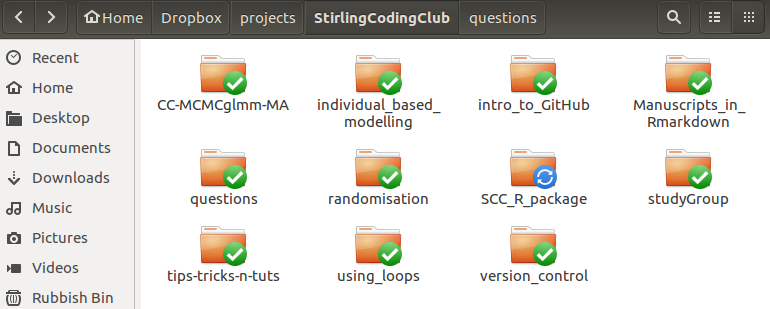
</center><br>

## The most basic R package

**Next, add a folder called 'R'**

<br><center>
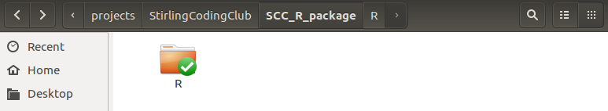
</center><br>

\pause

**Then drop the R scripts into the 'R' folder**

<br><center>
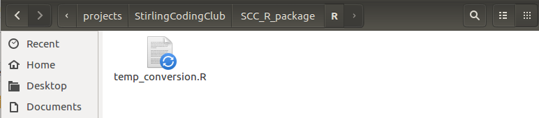
</center><br>

## The most basic R package

**Add a file called `DESCRIPTION` to the outer directory**. This is a plain text file that can just be a few lines of code.

```
Package: SCCTempConverter
Type: Package
Title: Temperature Conversion Package for Demonstration
Version: 0.0.1.0
RoxygenNote: 6.1.0
```

It can also include [a lot more information](https://github.com/ConFooBio/gmse/blob/master/DESCRIPTION) (e.g., authors, maintainers, extended description, website, etc.) if need be.

## The most basic R package

**This is now *already* an R package**, which we can load.

```{r, eval = FALSE, echo = TRUE}
# Working dir should be SCC_R_package
library(devtools);
load_all("."); 
```

\pause

Once loaded, we can start using the R functions in the package.

```{r, eval = TRUE, echo = TRUE}
C_to_F(20);
```

## Creating a new R project

To do this in Rstudio, go to `File > New Project...`

<br><center>
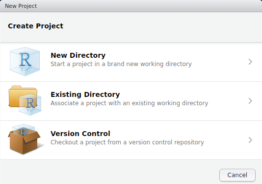
</center><br>


## Creating a new R project

To do this in Rstudio, go to `File > New Project...`

<br><center>
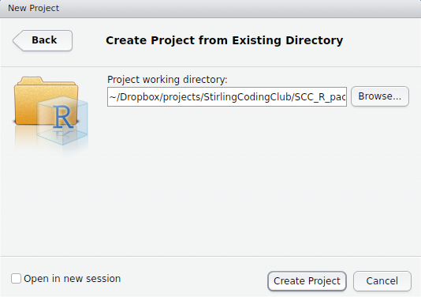
</center><br>


## Creating a new R project

To do this in Rstudio, go to `File > New Project...`

<br><center>
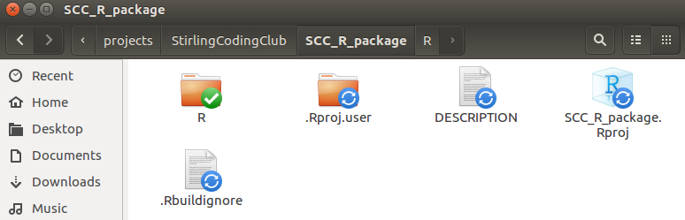
</center><br>


## Adding some minimal documentation

Documentation shows up in the 'Help' tab of RStudio when running the function `help`

```{r, eval = FALSE, echo = TRUE}
help(lm);
```

Note that the code below does the same thing as the code above.

```{r, eval = FALSE, echo = TRUE}
?lm
```


## Adding some minimal documentation

<br><center>
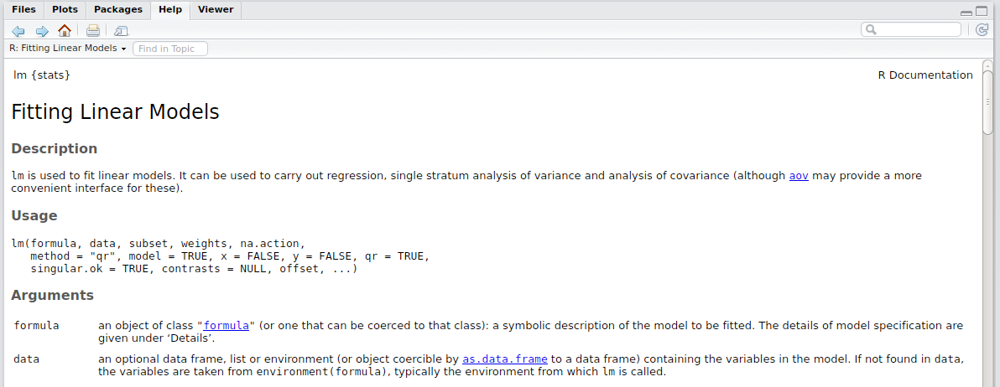
</center><br>

\pause

Create help files in Rstudio using the `roxygen2` package

```{r, eval = FALSE, echo = TRUE}
install.packages("roxygen2");
library(roxygen2);
```


## Adding some minimal documentation

```{r, eval = FALSE, echo = TRUE}
#' Fahrenheit conversion
#'
#' Convert degrees Fahrenheit temp to degrees Celsius
#' @param F_temp The temperature in degrees Fahrenheit
#' @return The temperature in degrees Celsius
#' @examples 
#' temp1 <- F_to_C(50);
#' temp2 <- F_to_C( c(50, 63, 23) );
#' @export
F_to_C <- function(F_temp){
    C_temp <- (F_temp - 32) * 5/9;
    return(C_temp);
}
```


## Adding some minimal documentation

If we load our package and type the following:

```{r, echo = TRUE, eval = FALSE}
help(F_to_C); # ?F_to_C also works
```

\pause

We get the below in RStudio

<br><center>
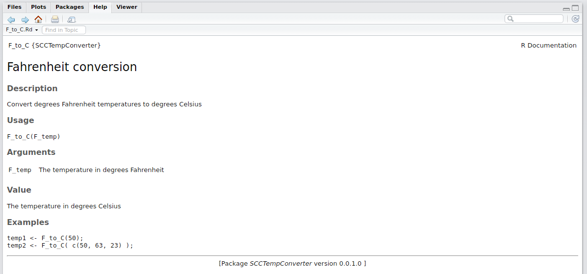
</center><br>

## Adding some minimal documentation

Note that a new folder has been added to the directory

<br><center>
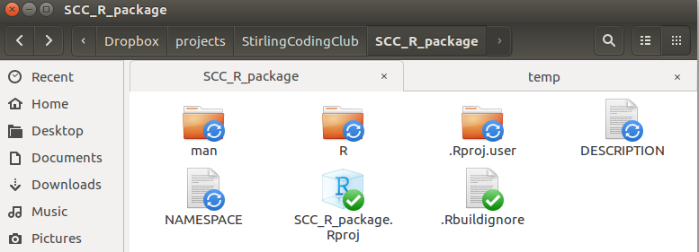
</center><br>


## Upload the package to GitHub

See notes on [version control](https://stirlingcodingclub.github.io/version_control/vc_notes.html) for help

<br><center>
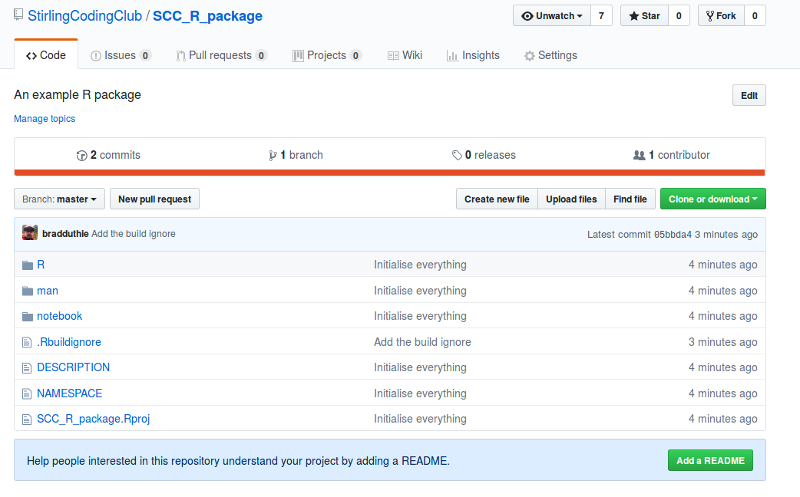
</center><br>

## Upload the package to GitHub

Anyone can download it by using the `install_github` function in the`devtools`

```{r, eval = FALSE, echo = TRUE}
library(devtools);
install_github("StirlingCodingClub/SCC_R_package");
```

Our R package is now installed. We can start using it by reading it in as a normal package.

```{r, eval = FALSE, echo = TRUE}
library(SCCTempConverter);
F_to_C(30);
```


## The R package design is very useful

**A reasonably large R package directory**

<br><center>
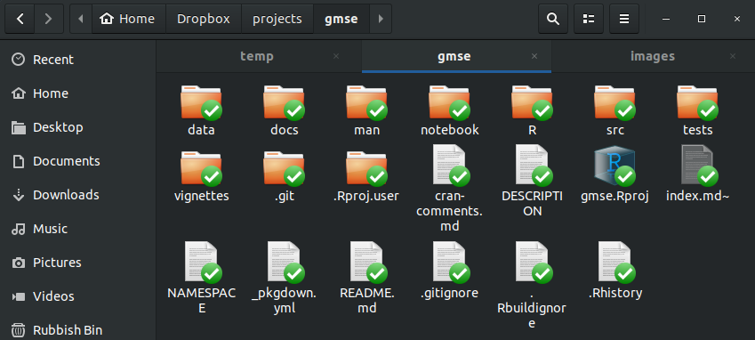
</center><br>


## The R package design is very useful

**A project for a manuscript in the R package style**

<br><center>
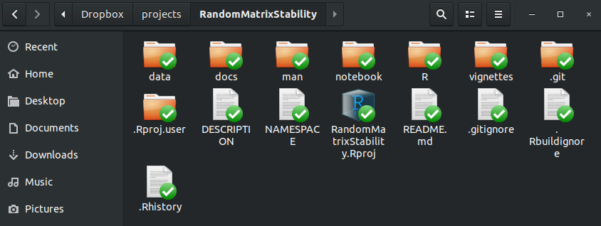
</center><br>

## Today's resources and additional help

Slides: https://stirlingcodingclub.github.io/SCC_R_package/notebook/Rpackage_slides.pdf

Notes: https://stirlingcodingclub.github.io/SCC_R_package/notebook/Rpackage_notes.html

**From [Karl Broman](https://kbroman.org/)**

- [The minimal R package](http://kbroman.org/pkg_primer/pages/minimal.html)
- [Building and installing an R package](http://kbroman.org/pkg_primer/pages/build.html)
- [Writing documentation with Roxygen2](http://kbroman.org/pkg_primer/pages/docs.html)

**From RStudio**

- [R packages](http://r-pkgs.had.co.nz/) (free online book). 
- [pkgdown](https://pkgdown.r-lib.org/) (automatically builds [package website](https://confoobio.github.io/gmse/))